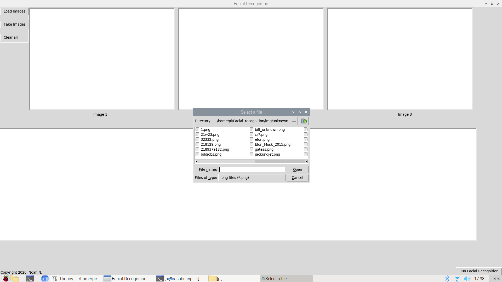

# Face Recognition
- Face Recognition on Raspberry Pi
- Created a own GUI, which loads/takes up to 3 images to run a face recognition algorithm
- Used tkinter, OpenCV, PIL, Pillow, Face_recognition

# User Guide and Prerequirements (only for Raspberry Pi with raspbian/linux os
- Start the Main.py \GUI\venv
- Edit your local branch structures if needed (see in Main.py which paths are used)
- If you want to edit the Face Recognition algorithm, edit the FaceRecognition.py file

# 1. Start Main.py which should open the GUI
# 2. Load (up to 3) or Take images: Take feature is linked to rasberry pi camera, therefore the command I used, should be adapted to your camera
 
# 3. Load the picture of the unknown order
# 4. If you want to use your images and your name detection, update the FaceRecognition.py file and add you as a person
First, add your picture in the known folder and specify it in the code like this: 

Then add the new created variable to known_faces_encodings and add your name to known_faces_names:

# 5. After loading/taking your images, press the Run Button.

